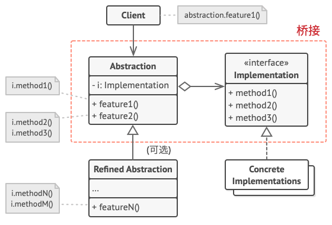

# 设计模式

## 重要概念

### 奇异递归模板模式

奇异递归模板模式（Curiously Recurring Template Pattern, CRTP）的理念很简单：继承者将自身作为模板参数传递给基类。

```cpp
struct Foo : SomeBase<Foo> {
    // ...
}
```

这么做的一个原因是：可以在基类的实现中访问特定类型的 `this` 指针。

### Mixin 继承

Mixin 继承是指“类模板继承它的模板参数”。

Mixin 继承允许不同类型的分层组合。例如，我们可以实例化一个 `Foo<Bar<Baz>>` 类型的对象，它实现了三个类的特性，而不需要实际构造一个全新的 `FooBarBaz` 类型。

Mixin 继承与概念（concept）组合使用十分有用，因为它允许我们对 Mixin 继承的类型施加约束，并使我们可以准确地使用基类的特性，而不依赖于编译时错误来告诉我们做错什么。

> 关于此方法的具体示例参见第 9 章。

### SOLID 设计原则

SOLID 是一个缩写词，代表以下设计原则：

- 单一职责原则 (Single Responsibility Principle, SRP)

  每个类只有一个职责。

  > 只有类的职责变化时，我们才需要修改该类。因此，遵循“单一职责原则”的类只有一个修改该类的原因。
  >
  > 违背单一职责原则的一个极端的反面模式被称为上帝对象（God Object）。上帝对象是指承担了尽可能多的职责的庞大的类，是一个极其难以对付的庞大的“怪物”。

- 开闭原则 (Open-Closed Principle, OCP)

  软件实体对扩展开放，对修改关闭。

  > 代码一旦完成编写和测试，就不应该修改，我们应该可以通过增加外部代码来对它进行扩展。

- 里氏替换原则 (Liskov Substitution Principle, LSP)

  如果某个接口接受基类对象作为参数，那么它应该能够接受派生类对象作为参数。

- 接口隔离原则 (Interface Segregation Principle, ISP)

  将复杂的接口分离成多个单独的接口，以避免强制实现者必须实现某些他们实际并不需要的接口。

- 依赖倒转原则 (Dependency Inversion Principle, DIP)

  - 高层模块不应该依赖低层模块，它们都应该依赖抽象接口。
  - 抽象接口不应该依赖具体实现细节，相反，具体实现细节应该依赖抽象接口。

## 创建型设计模式
### 工厂方法模式
意图：在父类中提供了一种创建对象的接口，允许子类决定实例化哪个类，从而让类的实例化推迟到子类中进行。

主要角色：

1. 抽象产品（Product）：产品接口
2. 具体产品（ConcreteProduct）：实现产品接口的具体类
3. 抽象工厂（Creator）：它需要使用某种产品，但不确定具体是哪种产品，于是声明了工厂方法接口
4. 具体工厂（ConcreteCreator）：重写工厂方法以返回具体产品实例


适用场景：

1. 当一个类不知道它所需要的对象的类时
2. 当一个类希望由它的子类来指定它所创建的对象时
3. 当需要灵活、可扩展的框架时
4. 需要解耦产品创建逻辑和使用逻辑时

```cpp
#include <cstdio>
#include <memory>

class Product {
   public:
    virtual ~Product() {}
    virtual void Operation() = 0;
};

class ConcreteProductA : public Product {
   public:
    void Operation() override { puts(__PRETTY_FUNCTION__); }
};

class ConcreteProductB : public Product {
   public:
    void Operation() override { puts(__PRETTY_FUNCTION__); }
};

class Creator {
   public:
    virtual ~Creator() {}
    virtual std::shared_ptr<Product> FactoryMethod() = 0;
    void SomeOperation() {
        auto product = FactoryMethod();
        product->Operation();
    }
};

class ConcreteCreatorA : public Creator {
   public:
    std::shared_ptr<Product> FactoryMethod() override { return std::make_shared<ConcreteProductA>(); }
};

class ConcreteCreatorB : public Creator {
   public:
    std::shared_ptr<Product> FactoryMethod() override { return std::make_shared<ConcreteProductB>(); }
};

void ClientCode(std::shared_ptr<Creator> creator) {
    creator->SomeOperation();
}

int main() {
    std::shared_ptr<Creator> creator_a = std::make_shared<ConcreteCreatorA>();
    ClientCode(creator_a);

    std::shared_ptr<Creator> creator_b = std::make_shared<ConcreteCreatorB>();
    ClientCode(creator_b);
}

```

### 抽象工厂模式
意图：提供一种方式来创建一系列相关或依赖对象的家族，而无需指定它们的具体类。

主要角色：

1. 抽象产品（AbstractProduct）：构成系列产品的一组不同但相关的产品接口
2. 具体产品（ConcreteProduct）：抽象产品的多种不同类型实现
3. 抽象工厂（AbstractFactory）：声明一组创建各种抽象产品的方法
4. 具体工厂（ConcreteFactory）: 实现抽象工厂的接口，每个具体工厂都对应特定系列产品变体，仅创建此系列产品变体


适用场景：程序需要与多个不同系列的相关产品交互，但是由于无法提前获取相关信息，或者出于对未来扩展性的考虑，你不希望程序基于产品的具体类进行构建。

```cpp
#include <cstdio>
#include <memory>

class AbstractProductA {
   public:
    virtual ~AbstractProductA() = default;
    virtual void Use() = 0;
};

class AbstractProductB {
   public:
    virtual ~AbstractProductB() = default;
    virtual void Use() = 0;
};

class ConcreteProductA1 : public AbstractProductA {
   public:
    void Use() override { puts(__PRETTY_FUNCTION__); }
};

class ConcreteProductB1 : public AbstractProductB {
   public:
    void Use() override { puts(__PRETTY_FUNCTION__); }
};

class ConcreteProductA2 : public AbstractProductA {
   public:
    void Use() override { puts(__PRETTY_FUNCTION__); }
};

class ConcreteProductB2 : public AbstractProductB {
   public:
    void Use() override { puts(__PRETTY_FUNCTION__); }
};

class AbstractFactory {
   public:
    virtual ~AbstractFactory() = default;
    virtual std::shared_ptr<AbstractProductA> CreateProductA() = 0;
    virtual std::shared_ptr<AbstractProductB> CreateProductB() = 0;
};

class ConcreteFactory1 : public AbstractFactory {
   public:
    std::shared_ptr<AbstractProductA> CreateProductA() override {
        return std::make_shared<ConcreteProductA1>();
    }
    std::shared_ptr<AbstractProductB> CreateProductB() override {
        return std::make_shared<ConcreteProductB1>();
    }
};

class ConcreteFactory2 : public AbstractFactory {
   public:
    std::shared_ptr<AbstractProductA> CreateProductA() override {
        return std::make_shared<ConcreteProductA2>();
    }
    std::shared_ptr<AbstractProductB> CreateProductB() override {
        return std::make_shared<ConcreteProductB2>();
    }
};

void ClientCode(std::shared_ptr<AbstractFactory> factory) {
    auto product_a = factory->CreateProductA();
    auto product_b = factory->CreateProductB();

    product_a->Use();
    product_b->Use();
}

int main() {
    auto factory1 = std::make_shared<ConcreteFactory1>();
    ClientCode(factory1);

    auto factory2 = std::make_shared<ConcreteFactory2>();
    ClientCode(factory2);
}
```

### 生成器模式
意图：使用户能够分步骤创建复杂对象，允许用户使用相同的创建代码生成不同类型和形式的对象。

> 复杂对象有很多种构造方法，难以仅通过一个简单的构造函数来创建。
>

主要角色：

1. 生成器（Builder）：声明子类生成器中通用的产品构造方法
2. 具体生成器（ConcreteBuilder）：提供构造过程的不同实现，也可以构造不遵循通用接口的产品
3. 产品（Products）：最终生成的对象。由不同生成器构造的产品无需属于同一类层次结构
4. 主管（Director）：定义调用构造步骤的顺序，可以用于创建和复用特定的产品配置


适用场景：

1. 构造函数有很多可选参数，不管是直接调用，还是重载多个构造函数，都很不方便
2. 你希望使用代码创建不同形式的产品，它们的制造过程相似仅有细节上的差异
3. 创建对象树或其他复杂对象

```cpp
#include <iostream>
#include <memory>
#include <string>
#include <vector>

class Product1 {
   public:
    void ListParts() const {
        std::cout << "Product parts: ";
        for (size_t i = 0; i < parts_.size(); i++) {
            if (i == parts_.size() - 1) {
                std::cout << parts_[i];
            } else {
                std::cout << parts_[i] << ", ";
            }
        }
        std::cout << "\n\n";
    }

    std::vector<std::string> parts_;
};

class Builder {
   public:
    virtual ~Builder() = default;
    virtual void BuildPartA() = 0;
    virtual void BuildPartB() = 0;
    virtual void BuildPartC() = 0;
};

class ConcreteBuilder1 : public Builder {
   public:
    ConcreteBuilder1() { product_ = std::make_shared<Product1>(); }
    ~ConcreteBuilder1() = default;

    void BuildPartA() override { product_->parts_.push_back("PartA"); }

    void BuildPartB() override { product_->parts_.push_back("PartB"); }

    void BuildPartC() override { product_->parts_.push_back("PartC"); }

    void Reset() { product_ = std::make_shared<Product1>(); }

    std::shared_ptr<Product1> product() { return product_; }

   private:
    std::shared_ptr<Product1> product_;
};

class Director {
   public:
    void set_builder(std::shared_ptr<Builder> builder) { builder_ = builder; }

    void BuildMinimalProduct() { builder_->BuildPartA(); }

    void BuildFullProduct() {
        builder_->BuildPartA();
        builder_->BuildPartB();
        builder_->BuildPartC();
    }

   private:
    std::shared_ptr<Builder> builder_;
};

void ClientCode(std::shared_ptr<Director> director) {
    auto builder = std::make_shared<ConcreteBuilder1>();

    director->set_builder(builder);

    std::cout << "Standard basic product:\n";
    director->BuildMinimalProduct();
    auto product1 = builder->product();
    product1->ListParts();

    std::cout << "Standard full featured product:\n";
    builder->Reset();
    director->BuildFullProduct();
    auto product2 = builder->product();
    product2->ListParts();

    std::cout << "Custom product:\n";
    builder->Reset();
    builder->BuildPartA();
    builder->BuildPartC();
    auto product3 = builder->product();
    product3->ListParts();
}

int main() {
    auto director = std::make_shared<Director>();
    ClientCode(director);
}
```

### 原型模式
意图：使用户能够复制已有对象，而又无需使代码依赖它们所属的类。

实现方式：

1. 定义原型接口，并在其中声明克隆方法（`Clone`）。
2. 原型类必须定义一个以该类对象为参数的构造函数。构造函数必须复制参数对象中的所有成员变量值到新建实体中。
3. 克隆方法通常只有一行代码： 使用 `new` 调用当前类的复制构造函数。
4. 还可以创建一个中心化原型注册表，用于存储常用原型。

```cpp
#include <memory>
#include <string>
#include <unordered_map>

enum class Type { PROTOTYPE_1 };

class Prototype {
   public:
    Prototype(const std::string& name) : name_(name) {}
    Prototype(const Prototype& other) : name_(other.name_) {}
    virtual ~Prototype() {}

    virtual std::unique_ptr<Prototype> Clone() = 0;

   private:
    std::string name_;
};

class ConcretePrototype1 : public Prototype {
   public:
    ConcretePrototype1(const std::string& name) : Prototype(name) {}
    ConcretePrototype1(const ConcretePrototype1& other) : Prototype(other) {}

    std::unique_ptr<Prototype> Clone() override {
        return std::make_unique<ConcretePrototype1>(*this);
    }
};

class PrototypeFactory final {
   private:
    std::unordered_map<Type, std::unique_ptr<Prototype>>
        prototypes_;

   public:
    PrototypeFactory() {
        prototypes_[Type::PROTOTYPE_1] =
            std::make_unique<ConcretePrototype1>("PROTOTYPE_1 ");
    }

    ~PrototypeFactory() {}

    std::unique_ptr<Prototype> CreatePrototype(Type type) {
        return prototypes_[type]->Clone();
    }
};

int main() {
    PrototypeFactory factory;
    auto prototype1 = factory.CreatePrototype(Type::PROTOTYPE_1);
}
```

## 结构型设计模式
### 适配器模式
意图：使接口不兼容的对象能够相互合作。

实现模式：

1. 确保至少有两个类的接口不兼容：
    - 一个无法修改（通常是第三方、遗留系统或者存在众多已有依赖的类）的功能性服务类。
    - 一个或多个将受益于使用服务类的客户端类。
2. 声明客户端接口，描述客户端如何与服务交互。
3. 创建遵循客户端接口的适配器类。所有方法暂时都为空。
4. 在适配器类中添加一个成员变量用于保存对于服务对象的引用。通常情况下会通过构造函数对该成员变量进行初始化，但有时在调用其方法时将该变量传递给适配器会更方便。
5. 依次实现适配器类客户端接口的所有方法。适配器会将实际工作委派给服务对象，自身只负责接口或数据格式的转换。
6. 客户端必须通过客户端接口使用适配器。这样一来，你就可以在不影响客户端代码的情况下修改或扩展适配器。

### 桥接模式
意图：将抽象部分与其实现部分分离，使两者可以独立变化。通常通过组合方式（抽象类持有实现类的指针/引用）实现，支持运行时动态切换实现类。

主要角色：

1. 抽象部分（Abstraction）：提供高层控制逻辑，依赖于完成底层实际工作的实现对象。
2. 实现部分（Implementation）：为所有具体实现声明通用接口。抽象部分仅能通过在这里声明的方法与实现对象交互。抽象部分可以列出和实现部分一样的方法，但是抽象部分通常声明一些复杂行为，这些行为依赖于多种由实现部分声明的原语操作。
3. 具体实现（Concrete Implementations）：包括特定于平台的代码。
4. 精确抽象（Refined Abstraction）提供控制逻辑的变体。与其父类一样，它们通过通用实现接口与不同的实现进行交互。

> 注意，这里提到的内容与编程语言中的接口或抽象类无关。
>



适用场景：

1. 想要拆分或重组一个具有多重功能的庞杂类（例如能与多个数据库服务器进行交互的类）
2. 希望在几个独立维度上扩展一个类
3. 需要在运行时切换不同实现方法

### 组合模式
意图：将对象组合成树形结构来表示"部分-整体"的层次结构，使得用户对单个对象和组合对象的使用具有一致性。

主要角色：

1. 组件（Component）：抽象类，描述了树中简单项目和复杂项目所共有的操作。
2. 叶节点（Leaf）：树的基本结构， 它不包含子项目。一般情况下，叶节点最终会完成大部分的实际工作，因为它们无法将工作指派给其他部分。
3. 组合（Composite）：包含叶节点或其他容器等子项目的单位。容器不知道其子项目所属的具体类，它只通过通用的组件接口与其子项目交互。容器接收到请求后会将工作分配给自己的子项目，处理中间结果，然后将最终结果返回调用方。


### 装饰器模式
意图：允许你通过将对象放入包含行为的特殊封装对象中来为原对象绑定新的行为。

### 外观模式
意图：使用一个外观类在现有复杂子系统的基础上提供一个更简单的接口，它包含了客户端真正关心的功能。

适用场景：程序需要与包含几十种功能的复杂子系统整合，但只需使用其中非常少的功能。

### 代理模式
意图：为原始对象提供某些强化功能，与此同时，准确或尽可能地保留原始对象对外提供的接口，使得代理对象成为原始对象的替代品，供用户使用，从而控制用户对原始对象的访问。

主要角色：

1. 服务接口（Service Interface）声明了服务接口，代理必须遵循该接口才能伪装成服务对象。
2. 服务（Service）提供了一些实用的业务逻辑。
3. 代理（Proxy）类包含一个指向服务对象的引用成员变量。代理完成其任务（例如延迟初始化、记录日志、访问控制和缓存等）后会将请求传递给服务对象。通常情况下，代理会对其服务对象的整个生命周期进行管理。
4. 客户端（Client）能通过同一接口与服务或代理进行交互，所以你可在一切需要服务对象的代码中使用代理。

## 行为型设计模式
### 命令模式
意图：将请求或操作封装为独立的对象，从而允许参数化客户端、队列化请求、记录日志或支持撤销操作。

主要角色：

1. 触发者（Invoker）负责对请求进行初始化，其中必须包含一个成员变量来存储对于命令对象的引用。发送者触发命令，而不向接收者直接发送请求。注意，发送者并不负责创建命令对象：它通常会通过构造函数从客户端处获得预先生成的命令。
2. 命令（Command）接口，通常仅声明一个执行命令的方法。
3. 具体命令（Concrete Commands）会实现各种类型的请求。具体命令自身并不完成工作，而是会将调用委派给一个业务逻辑对象。但为了简化代码，这些类可以进行合并。接收对象执行方法所需的参数可以声明为具体命令的成员变量。你可以将命令对象设为不可变，仅允许通过构造函数对这些成员变量进行初始化。
4. 接收者（Receiver）包含部分业务逻辑。几乎任何对象都可以作为接收者。绝大部分命令只处理如何将请求传递到接收者的细节，接收者自己会完成实际的工作。
5. 客户端（Client）会创建并配置具体命令对象。客户端必须将包括接收者实体在内的所有请求参数传递给命令的构造函数。此后，生成的命令就可以与一个或多个发送者相关联了。


